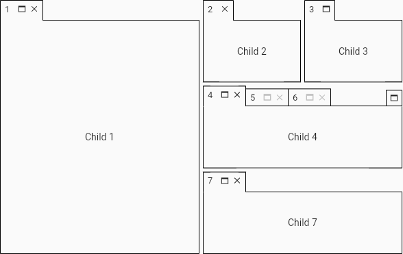
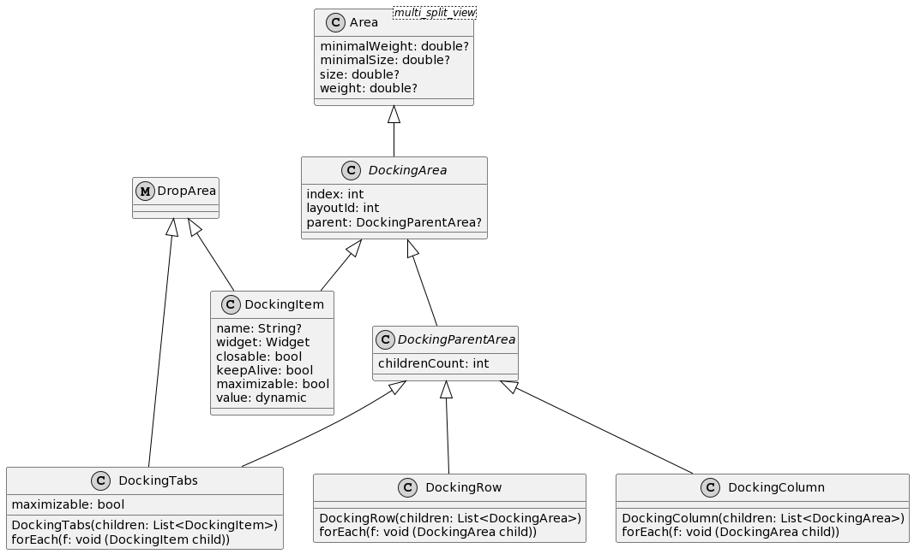
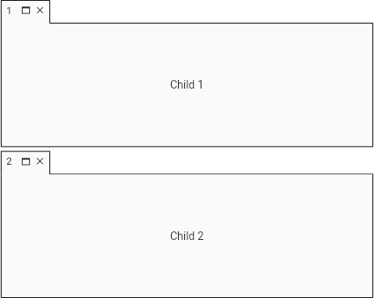
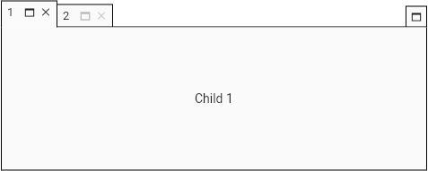
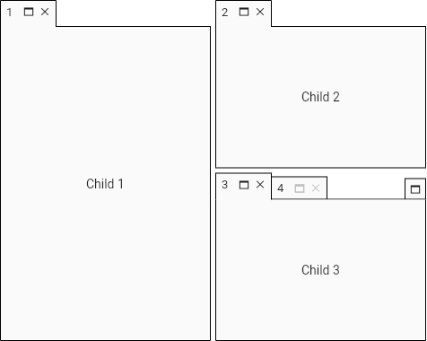
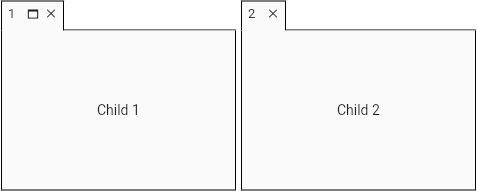
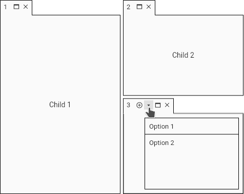
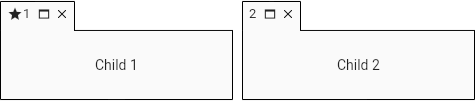
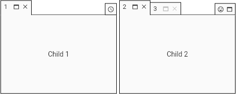
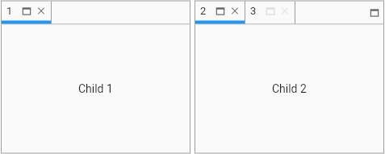

# Docking (1.14.0)

Layout for placing widgets in docking areas and arrange them into split and tabbed views.



## Dependencies

The following dependencies are exported along with this package:

* [tabbed_view (1.18.0)](https://pub.dev/packages/tabbed_view) to provide grouping of widgets into tabs
* [multi_split_view (2.4.0)](https://pub.dev/packages/multi_split_view) to provide horizontal or vertical split views

## Usage

* [Layout](#layout)
  * [Row](#row)
  * [Column](#column)
  * [Tabs](#tabs)
  * [Combined](#combined)
  * [Finding DockingItem by id](#finding-dockingitem-by-id)
  * [Removing DockingItem by id](#removing-dockingitem-by-id)
  * [Save and load](#save-and-load)
    * [Custom id parser](#custom-id-parser)
* Item
  * [Non-closable](#non-closable)
  * [Non-maximizable](#non-maximizable)
  * [Selection listener](#selection-listener)
  * [Close listener](#close-listener)
  * [Close interceptor](#close-interceptor)
  * [Buttons](#item-buttons)
  * [Leading widget](#item-leading-widget)
  * [Changing attributes](#changing-attributes)
* Size
  * [Minimal size](#minimal-size)
  * [Initial size](#initial-size)
  * [Initial weight](#initial-weight)
* [Docking buttons build](#docking-buttons-build)
* [State](#state)
* Theme
  * [Divider](#divider-theme)
  * [Tabs](#tabs-theme)
* [Old versions](#old-versions)
* [Support this project](#support-this-project)

## Layout

The layout is organized into areas: items (`DockingItem`), columns (`DockingColumn`), rows (`DockingRow`) and tabs (`DockingTabs`).
The root is single and can be any area.



### Row

```dart
    DockingLayout layout = DockingLayout(
        root: DockingRow([
      DockingItem(name: '1', widget: child1),
      DockingItem(name: '2', widget: child2)
    ]));
    Docking docking = Docking(layout: layout);
```


### Column

```dart
    DockingLayout layout = DockingLayout(
        root: DockingColumn([
      DockingItem(name: '1', widget: child1),
      DockingItem(name: '2', widget: child2)
    ]));
    Docking docking = Docking(layout: layout);
```



### Tabs

```dart
    DockingLayout layout = DockingLayout(
        root: DockingTabs([
          DockingItem(name: '1', widget: child1),
          DockingItem(name: '2', widget: child2)
        ]));
    Docking docking = Docking(layout: layout);
```



### Combined

```dart
    DockingLayout layout = DockingLayout(
        root: DockingRow([
      DockingItem(name: '1', widget: child1),
      DockingColumn([
        DockingItem(name: '2', widget: child2),
        DockingTabs([
          DockingItem(name: '3', widget: child3),
          DockingItem(name: '4', widget: child4)
        ])
      ])
    ]));
    Docking docking = Docking(layout: layout);
```



### Finding DockingItem by id

```dart
DockingItem? item = _layout.findDockingItem('id');
```

### Removing DockingItem by id

```dart
_layout.removeItemByIds([2, 4]);
```

### Save and Load

The `DockingLayout` offers the `stringify` method to allow save the layout. The same layout
can be restored by `load` method.
The instantiation of Widgets cannot be done automatically, for this it is necessary 
to define a builder.
The `DockingArea` ID can be used to identify which widget should be instantiated.

```dart
class MainWidgetState extends State<MainWidget>
    with LayoutParserMixin, AreaBuilderMixin {
  late DockingLayout _layout;
  String _lastStringify = '';

  @override
  void initState() {
    super.initState();
    _layout = DockingLayout(
        root: DockingRow([
      DockingItem(id: 'green', widget: greenWidget),
      DockingItem(id: 'blue', widget: blueWidget)
    ]));
  }

  @override
  Widget build(BuildContext context) {
    return Column(crossAxisAlignment: CrossAxisAlignment.stretch, children: [
      Row(children: [
        ElevatedButton(onPressed: _saveLayout, child: Text('Save layout')),
        SizedBox(width: 8),
        ElevatedButton(
            onPressed: _lastStringify.isNotEmpty ? _loadLayout : null,
            child: Text('Load layout'))
      ]),
      SizedBox(height: 8),
      Text('Last stringify: $_lastStringify'),
      SizedBox(height: 8),
      Expanded(child: Docking(layout: _layout))
    ]);
  }

  void _saveLayout() {
    setState(() {
      _lastStringify = _layout.stringify(parser: this);
    });
  }

  void _loadLayout() {
    if (_lastStringify.isNotEmpty) {
      _layout.load(layout: _lastStringify, parser: this, builder: this);
    }
  }

  Widget get greenWidget =>
      Center(child: Text('Green', style: TextStyle(color: Colors.green)));

  Widget get blueWidget =>
      Center(child: Text('Blue', style: TextStyle(color: Colors.blue)));

  @override
  DockingItem buildDockingItem(
      {required dynamic id, required double? weight, required bool maximized}) {
    if (id == 'green') {
      return DockingItem(
          id: id, weight: weight, maximized: maximized, widget: greenWidget);
    } else if (id == 'blue') {
      return DockingItem(
          id: id, weight: weight, maximized: maximized, widget: blueWidget);
    }
    throw StateError('ID not recognized: $id');
  }
}
```

#### Custom id parser

```dart
enum ExampleId { blue, green }

class MainWidgetState extends State<MainWidget>
    with AreaBuilderMixin
    implements LayoutParser {
  late DockingLayout _layout;
  String _lastStringify = '';

  @override
  void initState() {
    super.initState();
    _layout = DockingLayout(
        root: DockingRow([
      DockingItem(id: ExampleId.green, widget: greenWidget),
      DockingItem(id: ExampleId.blue, widget: blueWidget)
    ]));
  }

  @override
  Widget build(BuildContext context) {
    return Column(crossAxisAlignment: CrossAxisAlignment.stretch, children: [
      Row(children: [
        ElevatedButton(onPressed: _saveLayout, child: Text('Save layout')),
        SizedBox(width: 8),
        ElevatedButton(
            onPressed: _lastStringify.isNotEmpty ? _loadLayout : null,
            child: Text('Load layout'))
      ]),
      SizedBox(height: 8),
      Text('Last stringify: $_lastStringify'),
      SizedBox(height: 8),
      Expanded(child: Docking(layout: _layout))
    ]);
  }

  void _saveLayout() {
    setState(() {
      _lastStringify = _layout.stringify(parser: this);
    });
  }

  void _loadLayout() {
    if (_lastStringify.isNotEmpty) {
      _layout.load(layout: _lastStringify, parser: this, builder: this);
    }
  }

  Widget get greenWidget =>
      Center(child: Text('Green', style: TextStyle(color: Colors.green)));

  Widget get blueWidget =>
      Center(child: Text('Blue', style: TextStyle(color: Colors.blue)));

  @override
  DockingItem buildDockingItem(
      {required dynamic id, required double? weight, required bool maximized}) {
    if (id == ExampleId.green) {
      return DockingItem(
          id: id, weight: weight, maximized: maximized, widget: greenWidget);
    } else if (id == ExampleId.blue) {
      return DockingItem(
          id: id, weight: weight, maximized: maximized, widget: blueWidget);
    }
    throw StateError('ID not recognized: $id');
  }

  @override
  String idToString(dynamic id) {
    if (id == null) {
      // row, column and tabs
      return '';
    }
    // item
    ExampleId exampleId = id;
    // Just a simple example but don't do this as it depends on not changing
    // the order of values in the enum.
    return exampleId.index.toString();
  }

  @override
  dynamic stringToId(String id) {
    if (id.isEmpty) {
      return null;
    }
    int index = int.parse(id);
    return ExampleId.values[index];
  }
}
```

## Item

### Non-closable

```dart
    DockingLayout layout = DockingLayout(
        root: DockingRow([
      DockingItem(name: '1', widget: child1),
      DockingItem(name: '2', widget: child2, closable: false)
    ]));
    Docking docking = Docking(layout: layout);
```


### Non-maximizable

```dart
    DockingLayout layout = DockingLayout(
        root: DockingRow([
      DockingItem(name: '1', widget: child1),
      DockingItem(name: '2', widget: child2, maximizable: false)
    ]));
    Docking docking = Docking(layout: layout);
```



### Selection listener

```dart
    DockingLayout layout = DockingLayout(
        root: DockingTabs([
          DockingItem(name: '1', widget: child1),
          DockingItem(name: '2', widget: child2),
          DockingItem(name: '3', widget: child3)
        ]));
    Docking docking = Docking(
        layout: layout,
        onItemSelection: (DockingItem item) {
          print(item.name!);
        });
```

### Close listener

```dart
    DockingLayout layout = DockingLayout(
        root: DockingRow([
      DockingItem(name: '1', widget: child1),
      DockingItem(name: '2', widget: child2),
      DockingItem(name: '3', widget: child3)
    ]));
    Docking docking = Docking(
        layout: layout,
        onItemClose: (DockingItem item) {
          _onItemClose(context, item);
        });
```

```dart
  void _onItemClose(BuildContext context, DockingItem item) {
    ScaffoldMessenger.of(context).showSnackBar(SnackBar(
        content: Text('item ' + item.name! + ' has been closed'),
        duration: const Duration(seconds: 3)));
  }
```

### Close interceptor

```dart
    DockingLayout layout = DockingLayout(
        root: DockingRow([
      DockingItem(name: '1', widget: child1),
      DockingItem(name: '2', widget: child2)
    ]));
    Docking docking = Docking(
        layout: layout,
        itemCloseInterceptor: (DockingItem item) {
          return _checkItem(context, item);
        });
```

```dart
  bool _checkItem(BuildContext context, DockingItem item) {
    if (item.name == '1') {
      ScaffoldMessenger.of(context).showSnackBar(SnackBar(
          content: const Text('item 1 can not be closed'),
          duration: const Duration(seconds: 3)));
      return false;
    }
    return true;
  }
```

### Item buttons

```dart
    import 'package:tabbed_view/tabbed_view.dart';
```

```dart
    DockingLayout layout = DockingLayout(
        root: DockingRow([
          DockingItem(name: '1', widget: child1),
          DockingColumn([
            DockingItem(name: '2', widget: child2),
            DockingItem(name: '3', widget: child3, buttons: [
              TabButton(
                      icon: IconProvider.data(Icons.add_circle_outline),
                      onPressed: () => _toast(context, 'add button')),
              TabButton(
                      icon: IconProvider.data(Icons.arrow_drop_down_outlined),
                      menuBuilder: (context) {
                        return [
                          TabbedViewMenuItem(
                                  text: 'Option 1',
                                  onSelection: () => _toast(context, '1')),
                          TabbedViewMenuItem(
                                  text: 'Option 2', onSelection: () => _toast(context, '2'))
                        ];
                      })
            ])
          ])
        ]));
Docking docking = Docking(layout: layout);
```



### Item leading widget

```dart
    DockingLayout layout = DockingLayout(
        root: DockingRow([
      DockingItem(
          name: '1',
          widget: child1,
          leading: (context, status) => Icon(Icons.star, size: 16)),
      DockingItem(name: '2', widget: child2)
    ]));
    Docking docking = Docking(layout: layout);
```



### Changing attributes

```dart
    DockingItem? item = _layout.findDockingItem('id');
    if (item != null) {
      Random random = Random();
      item.name = random.nextInt(9999).toString();
      _layout.rebuild();
```

## Size

### Minimal size

```dart
    DockingLayout layout = DockingLayout(
        root: DockingRow([
      DockingItem(name: '1', minimalSize: 200, widget: child1),
      DockingItem(name: '2', widget: child2)
    ]));
```

### Initial size

```dart
    DockingLayout layout = DockingLayout(
        root: DockingRow([
      DockingItem(name: '1', size: 100, widget: child1),
      DockingItem(name: '2', widget: child2)
    ]));
```

### Initial weight

```dart
    DockingLayout layout = DockingLayout(
        root: DockingRow([
      DockingItem(name: '1', weight: .2, widget: child1),
      DockingItem(name: '2', widget: child2)
    ]));
```

## Docking buttons build

```dart
    DockingLayout layout = DockingLayout(
        root: DockingRow([
      DockingItem(name: '1', widget: child1),
      DockingTabs([
        DockingItem(name: '2', widget: child2),
        DockingItem(name: '3', widget: child3)
      ])
    ]));
    Docking docking =
        Docking(layout: layout, dockingButtonsBuilder: _buttonsBuilder);
```

```dart
  List<TabButton> _buttonsBuilder(BuildContext context,
        DockingTabs? dockingTabs, DockingItem? dockingItem) {
  if (dockingTabs != null) {
    // docking area is a DockingTabs
    return [
      TabButton(
              icon: IconProvider.data(Icons.tag_faces_outlined),
              onPressed: () => print('Smile!'))
    ];
  }
  // docking area is a DockingItem
  return [
    TabButton(
            icon: IconProvider.data(Icons.access_time),
            onPressed: () => print('Time button!'))
  ];
}
```



## State

The drag action can change the tree structure due to a new arrangement of rows, columns or tabs.
The *keepAlive* parameter keeps the state during the layout change.
This feature implies using GlobalKeys and keeping the widget in memory even if the tab is not selected.

```dart
    DockingItem(name: 'myStatefulWidget', widget: myStatefulWidget, keepAlive: true);
```

## Theme

### Divider theme

You should use the *MultiSplitViewTheme* widget to apply the theme to all descendant widgets.

Read more information about themes on [multi_split_view](https://pub.dev/packages/multi_split_view).

```dart
    DockingLayout layout = DockingLayout(
        root: DockingRow([
      DockingItem(name: '1', widget: child1),
      DockingColumn([
        DockingItem(name: '2', widget: child2),
        DockingItem(name: '3', widget: child3)
      ])
    ]));
    Docking docking = Docking(layout: layout);
    MultiSplitViewTheme theme = MultiSplitViewTheme(
        child: docking,
        data: MultiSplitViewThemeData(
            dividerThickness: 15,
            dividerPainter: DividerPainters.grooved2(
                backgroundColor: Colors.grey[700]!,
                color: Colors.grey[400]!,
                highlightedColor: Colors.white)));
    Container container = Container(
      padding: EdgeInsets.all(16),
      child: theme,
      color: Colors.grey[700]!,
    );
```


### Tabs theme

You should use the *TabbedViewTheme* widget to apply the theme to all descendant widgets.

Read more information about themes on [tabbed_view](https://pub.dev/packages/tabbed_view).

```dart
    DockingLayout layout = DockingLayout(
        root: DockingRow([
      DockingItem(name: '1', widget: child1),
      DockingTabs([
        DockingItem(name: '2', widget: child2),
        DockingItem(name: '3', widget: child3)
      ])
    ]));
    Docking docking = Docking(layout: layout);
    TabbedViewTheme theme =
        TabbedViewTheme(child: docking, data: TabbedViewThemeData.mobile());
```



## Old versions

Find documentation for older versions [here](old_versions.md).

## Support this project

### Bitcoin

[bc1qhqy84y45gya58gtfkvrvass38k4mcyqnav803h](https://www.blockchain.com/pt/btc/address/bc1qhqy84y45gya58gtfkvrvass38k4mcyqnav803h)

### Kaspa

[kaspa:qqu9zjtvnp7j5axykaa4a3gqnq79a9n6a45gtffn3pek2fmllzk3gqnc2lmha](https://explorer.kaspa.org/addresses/kaspa:qqu9zjtvnp7j5axykaa4a3gqnq79a9n6a45gtffn3pek2fmllzk3gqnc2lmha)

### Ethereum (ERC-20) or Binance Smart Chain (BEP-20)

[0x9eB815FD4c88A53322304143A9Aa8733D3369985](https://etherscan.io/address/0x9eb815fd4c88a53322304143a9aa8733d3369985)